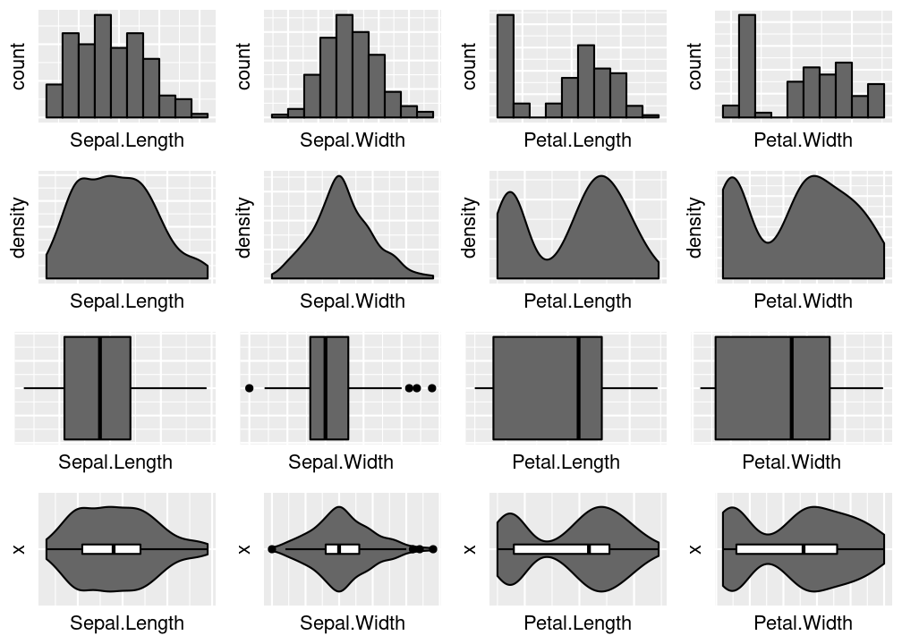

<!-- README.md foi gerado por README.Rmd -->

# Análise Descritiva

Pacote de R para análise descritiva.

## Instalação

``` r
install.packages("devtools")
devtools::install_github("elemosjr/analisedescritiva")
```

## Exemplos

``` r
library(analisedescritiva)

conjunta_bar_cd(iris)
```

<!-- -->
